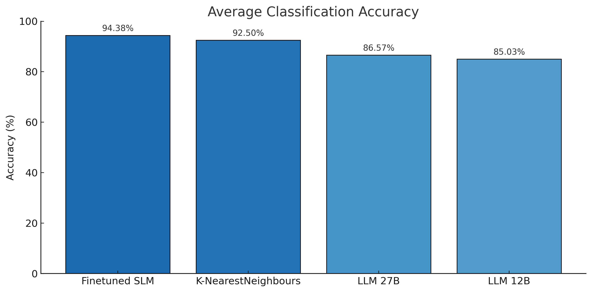

# SLM versus LLM Comparison

This repository contains various experiments (and will be further expanded...) for comparing Small Language Models (SLM's) versus Large Language Models (LLM's). Occasionally older algorithms will be added to the comparison.

In a lot of situations LLM's can provide a generic and powerfull solution to various kinds of problems. Specifically optimized SLM's can sometimes however be a better and cheaper solution to a problem.

## Installation

To be able to re-run the experiments create a Python environment and install the packages as specified in the requirements.txt

# Experiments

## Text Classification

The dataset used is the AG News Subset. It is a dataset that contains 120K news items (training data) related to 4 major topics. The test dataset contains 7600 news items. It's a small and ideal dataset to use for text classification.

In this experiment the target is to classify the 4 major news topics correctly.This solution can however easily be applied to for example: Customer Intent Detection, Sentiment Classification for a Helpdesk, Model Routing etcetera.

The experiment contains the following setup:
- A basic Exploratory Data Analysis
- An experiment where we use vector embeddings and K-NearestNeighbour to perform the classification
- An experiment where we use a Small Language Model [HuggingFaceTB/SmolLM2-135M-Instruct](https://huggingface.co/HuggingFaceTB/SmolLM2-135M-Instruct) that will be supervised finetuned as a classification model.
- An experiment where we use a generic LLM combined with structured outputs to perform the classification.

The repository contains the following 4 Jupyter Notebooks that implement the experiment setup:
- EDA.ipynb: Notebook for Exploratory Data Analysis.
- K-NN.ipynb: Notebook using K-NearestNeighbour algorithm for classification.
- FinetuneSLM.ipynb: Notebook for finetuning an SLM specifically for classification.
- LLM.ipynb: Notebook using a generic LLM with structured outputs for classification.

Before discussing the results, first lets show them to get a good impression of the varying performance for each experiment.

<< TODO >>